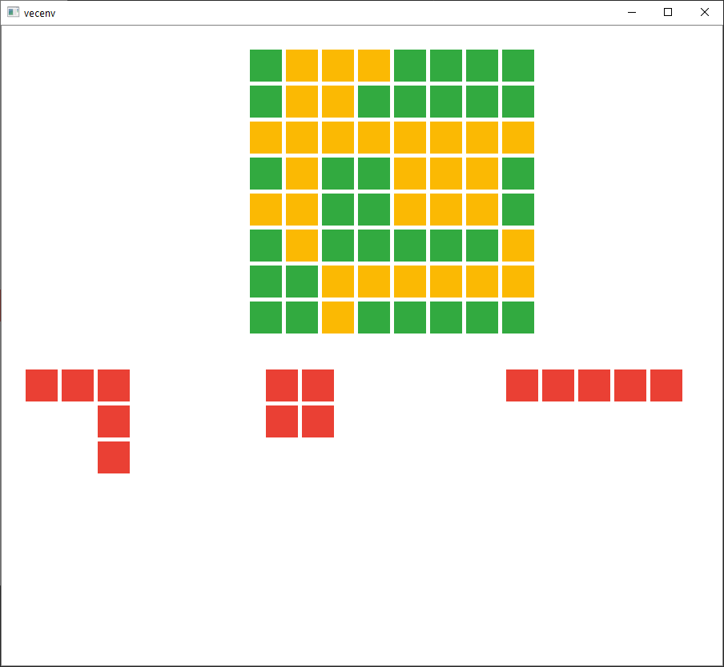

# BlockPuzzleGym

This is a Block Puzzle OpenAI Gym.

# Rules
Three blocks are assigned and have to be placed on the board (8x8). Getting a line, either horizontally or vertically will clear that line.
You get points for placing a block on the board and additional points for clearing a line. Clearing more lines at the same time gives you additional points.

# Observation space and action
The observation space consists of float 0 to 1.
First 8 arrays are the board, and last array are the puzzle pieces (divided by total puzzle pieces)
Example:
```
[[0,0,0,0,0,0,0,0], <-- From here is the board data
[0,0,0,0,0,0,0,0],
[0,0,0,0,0,0,0,0],
[0,0,0,0,0,0,0,0],
[0,0,0,0,0,0,0,0],
[0,0,0,0,0,0,0,0],
[0,0,0,0,0,0,0,0],
[0,0,0,0,0,0,0,0],  <--  to here is the board data
[0,0,0,0,0,0,0,0]]  <-- First 3 are the pieces to choose from. 
```

Action space is a multidiscrete, first the number of the piece (1 - 3), then a block on which to place the block (0 - 8*8)
Everytime a piece is placed on the board, it becomes 0 in the observation space. and the places they occupied becomes 1s

# Render
You can also render to see what it is doing:


